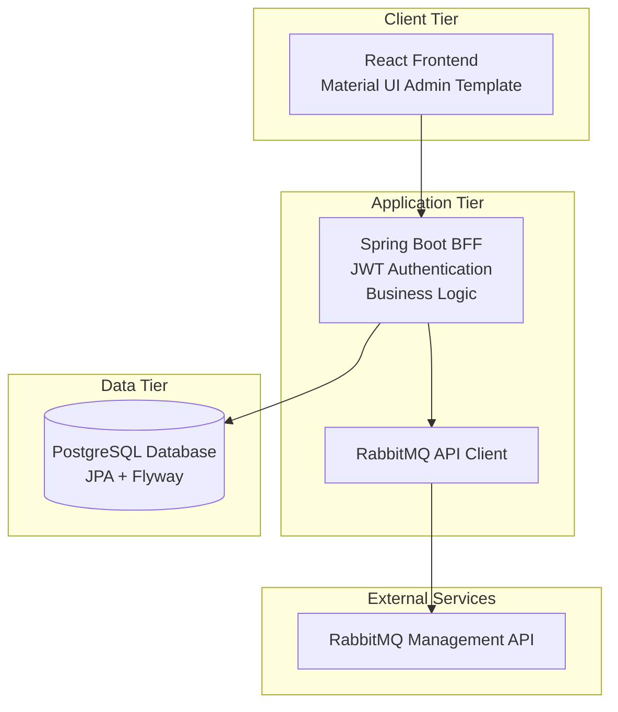
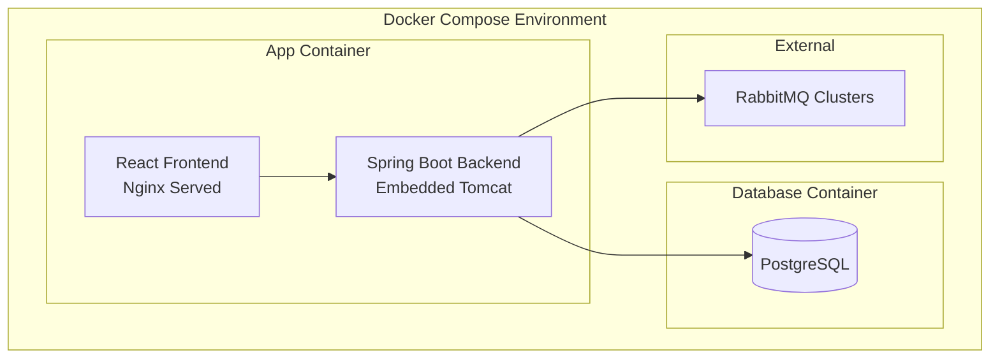

# Design Document

## Overview

RabbitMQ Admin is a three-tier web application that provides a comprehensive administrative interface for managing RabbitMQ clusters. The application implements role-based access control with JWT authentication and follows modern web development practices using React, Spring Boot, and PostgreSQL.

The system architecture separates concerns across presentation (React frontend), business logic (Spring Boot BFF), and data persistence (PostgreSQL) layers, all containerized for consistent deployment across environments.

## Architecture

### High-Level Architecture



### Technology Stack

- **Frontend**: React 18+ with Material UI v5, TypeScript
- **Backend**: Java 21, Spring Boot 3.x, Spring Security, Spring Data JPA
- **Database**: PostgreSQL 15+, Flyway migrations
- **Authentication**: JWT tokens with Spring Security
- **Containerization**: Docker, Docker Compose
- **Build Tools**: Maven (backend), npm/yarn (frontend)

### Multi-Cluster Connection Architecture

The application is designed to manage multiple RabbitMQ clusters simultaneously:

- **Dynamic Client Pool**: The backend maintains a pool of HTTP clients, one for each configured cluster connection
- **Cluster Routing**: API requests include a `clusterId` parameter that determines which RabbitMQ cluster to target
- **Connection Management**: Each cluster connection stores its own API endpoint and credentials
- **User Assignment**: Users can be assigned to multiple clusters, and only see clusters they have access to
- **Failover Handling**: Individual cluster failures don't affect access to other clusters

### Deployment Architecture



## Components and Interfaces

### State Management Patterns

The application uses React Context for global state management with optimized patterns:

#### ClusterContext State Management

The `ClusterContext` implements an optimized state management pattern:

```typescript
// Individual state setters for better performance
const setLoading = (loading: boolean) => {
  setState((prev) => ({ ...prev, loading }));
};

const setError = (error: string | null) => {
  setState((prev) => ({ ...prev, error }));
};

const setClusters = (clusters: ClusterConnection[]) => {
  setState((prev) => ({ ...prev, clusters }));
};

const setSelectedCluster = (selectedCluster: ClusterConnection | null) => {
  setState((prev) => ({ ...prev, selectedCluster }));
};
```

**Benefits of this pattern:**

- **Performance**: Individual setters prevent unnecessary re-renders
- **Maintainability**: Clear separation of concerns for different state updates
- **Debugging**: Easier to track specific state changes
- **Type Safety**: Better TypeScript inference for state updates

**Dependency Management**: The `refreshClusters` function includes proper dependencies to prevent infinite loops while ensuring state consistency:

```typescript
const refreshClusters = useCallback(async () => {
  // Implementation uses individual setters
  // Dependency array includes state.selectedCluster for proper updates
}, [user, state.selectedCluster]);
```

### Frontend Components

#### Core Layout Components

- **AppLayout**: Main application shell with hamburger navigation, top ribbon, and content area
- **Sidebar**: Collapsible navigation menu with role-based menu items
- **TopBar**: Application header with logo and user menu
- **UserMenu**: Sign-out functionality in bottom-left position

#### Authentication Infrastructure Components

- **AuthNavigationSetup**: Navigation configuration component that integrates React Router with token expiration handling
  - Must be rendered inside Router context
  - Sets up navigation callback for `tokenExpirationHandler.setNavigateToLogin()`
  - Handles return URL preservation for post-login redirects
  - Automatically cleans up navigation callback on component unmount
  - Uses `replace: true` for login navigation to prevent back button issues

#### Authentication Components

- **LoginForm**: Username/password authentication with validation
- **ProtectedRoute**: Route wrapper for authenticated access
- **AuthProvider**: Context provider for authentication state
- **AuthNavigationSetup**: Utility component that configures React Router navigation for token expiration handling

#### Context Management Components

- **ClusterProvider**: Context provider for cluster state management with optimized state updates
  - Individual state setter functions for better performance and maintainability
  - Automatic cluster selection for first active cluster
  - Role-based cluster data fetching (admin vs user endpoints)
  - Proper dependency management to prevent infinite re-renders

#### Dashboard Components

- **Dashboard**: Main landing page showing available cluster connections
- **ClusterConnectionCard**: Individual cluster connection display and selection
- **ClusterSelector**: Interface for choosing active cluster

#### User Management Components (Admin Only)

- **UserList**: Table view of all users with CRUD operations
- **UserForm**: Create/edit user form with role assignment
- **UserDetails**: Detailed view of user information

#### Cluster Management Components (Admin Only)

- **ClusterConnectionList**: Management interface for cluster connections
- **ClusterConnectionForm**: Create/edit cluster connection details
- **ConnectionTest**: Utility to test cluster connectivity

### Backend Components

#### Security Layer

- **JwtAuthenticationFilter**: Validates JWT tokens on all protected endpoints with comprehensive debug logging for troubleshooting authentication issues
- **JwtTokenProvider**: Generates and validates JWT tokens
- **SecurityConfig**: Spring Security configuration with role-based access
- **AuthenticationController**: Login/logout endpoints

#### Service Layer

- **UserService**: User management business logic
- **ClusterConnectionService**: Cluster connection management
- **RabbitMQClientService**: Dynamic client factory for multiple RabbitMQ clusters
- **RabbitMQProxyService**: Proxy service that routes requests to appropriate cluster
- **AuthenticationService**: Authentication and token management

#### Repository Layer

- **UserRepository**: JPA repository for user data access
- **ClusterConnectionRepository**: JPA repository for cluster connections
- **UserClusterAssignmentRepository**: Many-to-many relationship management

#### Controller Layer

- **AuthController**: Authentication endpoints (`/api/auth/*`)
- **UserController**: User management endpoints (`/api/users/*`)
- **ClusterController**: Cluster management endpoints (`/api/clusters/*`)
- **RabbitMQController**: RabbitMQ proxy endpoints (`/api/rabbitmq/*`) with cluster routing

### API Design

#### Authentication Endpoints

```
POST /api/auth/login
POST /api/auth/logout
GET  /api/auth/me
```

#### User Management Endpoints (Admin Only)

```
GET    /api/users
POST   /api/users
GET    /api/users/{id}
PUT    /api/users/{id}
DELETE /api/users/{id}
```

#### Cluster Connection Endpoints (Admin Only)

```
GET    /api/clusters
POST   /api/clusters
GET    /api/clusters/{id}
PUT    /api/clusters/{id}
DELETE /api/clusters/{id}
POST   /api/clusters/{id}/test
```

#### RabbitMQ Proxy Endpoints

```
GET    /api/rabbitmq/{clusterId}/overview
GET    /api/rabbitmq/{clusterId}/queues
GET    /api/rabbitmq/{clusterId}/exchanges
GET    /api/rabbitmq/{clusterId}/connections
GET    /api/rabbitmq/{clusterId}/nodes
POST   /api/rabbitmq/{clusterId}/queues
DELETE /api/rabbitmq/{clusterId}/queues/{queueName}
```

**Multi-Cluster Routing**: All RabbitMQ proxy endpoints dynamically route to the appropriate cluster based on the `clusterId` parameter. The system works as follows:

1. **Client Pool Management**: The `RabbitMQClientService` maintains a concurrent map of HTTP clients, keyed by cluster connection ID
2. **Request Routing**: The `RabbitMQProxyService` validates user access to the requested cluster and routes the API call
3. **Credential Management**: Each cluster connection stores its own API credentials, used automatically for authentication
4. **Error Isolation**: Failures in one cluster don't affect operations on other clusters
5. **Dynamic Updates**: When cluster connections are modified, the client pool is updated without service restart

## Data Models

### User Entity

```java
@Entity
@Table(name = "users")
public class User {
    @Id
    @GeneratedValue(strategy = GenerationType.UUID)
    private UUID id;

    @Column(unique = true, nullable = false)
    private String username;

    @Column(nullable = false)
    private String passwordHash;

    @Enumerated(EnumType.STRING)
    @Column(nullable = false)
    private UserRole role;

    @Column(nullable = false, updatable = false)
    private LocalDateTime createdAt;

    @ManyToMany
    @JoinTable(name = "user_cluster_assignments")
    private Set<ClusterConnection> assignedClusters;
}
```

### ClusterConnection Entity

```java
@Entity
@Table(name = "cluster_connections")
public class ClusterConnection {
    @Id
    @GeneratedValue(strategy = GenerationType.UUID)
    private UUID id;

    @Column(nullable = false)
    private String name;

    @Column(nullable = false)
    private String apiUrl;

    @Column(nullable = false)
    private String username;

    @Column(nullable = false)
    private String password;

    @Column
    private String description;

    @Column(nullable = false)
    private Boolean active;

    @ManyToMany(mappedBy = "assignedClusters")
    private Set<User> assignedUsers;
}
```

### Database Schema Migration Strategy

- **V1\_\_Initial_Schema.sql**: Create users and cluster_connections tables
- **V2\_\_User_Cluster_Assignments.sql**: Create many-to-many relationship table
- **V3\_\_Add_Indexes.sql**: Performance optimization indexes
- **V4\_\_Default_Admin_User.sql**: Insert default administrator account

## Error Handling

### Frontend Error Handling

- **Global Error Boundary**: Catches and displays React component errors
- **API Error Interceptor**: Handles HTTP errors and token expiration
- **Form Validation**: Client-side validation with Material UI form components
- **Toast Notifications**: User-friendly error and success messages

### Backend Error Handling

- **Global Exception Handler**: `@ControllerAdvice` for consistent error responses
- **Custom Exceptions**: Domain-specific exceptions with appropriate HTTP status codes
- **Validation Errors**: Bean validation with detailed error messages
- **Security Exceptions**: Authentication and authorization error handling

### Error Response Format

```json
{
  "timestamp": "2024-01-15T10:30:00Z",
  "status": 400,
  "error": "Bad Request",
  "message": "Username already exists",
  "path": "/api/users",
  "details": {
    "field": "username",
    "rejectedValue": "admin"
  }
}
```

## Testing Strategy

### Backend Testing Approach

#### Unit Tests

- **Service Layer Tests**: Mock dependencies, test business logic
- **Repository Tests**: `@DataJpaTest` for database operations
- **Controller Tests**: `@WebMvcTest` for endpoint behavior
- **Security Tests**: Authentication and authorization scenarios

#### Integration Tests

- **API Integration Tests**: `@SpringBootTest` with TestContainers for PostgreSQL
- **RabbitMQ Integration Tests**: Mock RabbitMQ API responses
- **End-to-End Tests**: Full application flow testing

#### Test Data Management

- **Test Profiles**: Separate configuration for test environments
- **Database Cleanup**: `@Transactional` rollback for test isolation
- **Test Fixtures**: Reusable test data builders

### Testing Tools and Frameworks

- **JUnit 5**: Primary testing framework
- **Mockito**: Mocking framework for unit tests
- **TestContainers**: Integration testing with real PostgreSQL
- **WireMock**: Mock external RabbitMQ API calls
- **Spring Boot Test**: Testing utilities and annotations

### Coverage Goals

- **Minimum Coverage**: 80% line coverage for service and controller layers
- **Critical Path Coverage**: 100% coverage for authentication and security logic
- **Integration Coverage**: All API endpoints tested with positive and negative scenarios

## Security Considerations

### Authentication Security

- **Password Hashing**: BCrypt with configurable strength
- **JWT Security**: RS256 signing, short expiration times, refresh token strategy
- **Session Management**: Stateless authentication with secure token storage
- **Debug Logging**: Comprehensive authentication logging for troubleshooting without exposing sensitive data
- **Token Expiration Handling**: Integrated navigation system for seamless login redirects with return URL preservation

### Authorization Security

- **Role-Based Access**: Method-level security with `@PreAuthorize`
- **Resource Protection**: User can only access assigned cluster connections
- **Admin Privileges**: Strict separation of admin-only operations

### Data Security

- **Input Validation**: Bean validation on all input parameters
- **SQL Injection Prevention**: JPA parameterized queries
- **XSS Protection**: Content Security Policy headers
- **CORS Configuration**: Restricted cross-origin requests

### Infrastructure Security

- **Container Security**: Non-root user in Docker containers
- **Database Security**: Connection encryption, credential management
- **API Security**: Rate limiting, request size limits
- **Logging Security**: Sensitive data exclusion from logs

### Authentication Troubleshooting

The JWT authentication system includes comprehensive debug logging capabilities for troubleshooting authentication issues:

#### Debug Logging Configuration

Enable detailed authentication logging by setting the log level:

```yaml
logging:
  level:
    com.rabbitmq.admin.security.JwtAuthenticationFilter: DEBUG
```

#### Logged Information

When debug logging is enabled, the system logs:

1. **Request Processing**: HTTP method and path for each request
2. **Token Presence**: Whether JWT token is present in Authorization header
3. **Token Validation**: Result of JWT token validation
4. **User Authentication**: User ID extraction and user details loading
5. **Security Context**: Authentication setup in Spring Security context
6. **Error Handling**: Enhanced error messages with request context

#### Security Considerations

- **No Sensitive Data**: JWT tokens and passwords are never logged
- **Debug Level Only**: Detailed information only at DEBUG level
- **Production Safe**: Safe to enable in production for troubleshooting
- **Minimal Performance Impact**: Negligible overhead when disabled

This enhanced logging enables rapid diagnosis of authentication issues while maintaining security best practices.

### Token Expiration and Navigation Integration

The application implements a sophisticated token expiration handling system that integrates seamlessly with React Router navigation:

#### Architecture Pattern

```typescript
// Token expiration handler with navigation integration
tokenExpirationHandler.setNavigateToLogin((returnUrl) => {
  navigate(ROUTES.LOGIN, {
    state: { from: returnUrl || location.pathname + location.search },
    replace: true,
  });
});
```

#### Component Integration

The `AuthNavigationSetup` component establishes the bridge between the token expiration handler and React Router:

1. **Router Context Dependency**: Must be rendered inside Router context to access navigation hooks
2. **Navigation Callback Setup**: Configures the token expiration handler with React Router navigation
3. **Return URL Preservation**: Captures current location for post-login redirect
4. **Cleanup Management**: Removes navigation callback when component unmounts
5. **Replace Navigation**: Uses `replace: true` to prevent back button navigation to expired sessions

#### Integration Points

- **API Client**: The `apiClient` uses the token expiration handler for 401 error responses
- **Automatic Refresh**: Token refresh attempts before redirecting to login
- **Seamless UX**: Users are redirected to login with their intended destination preserved
- **Security**: Expired tokens are immediately cleared and navigation is forced

This pattern ensures that token expiration is handled consistently across the application while maintaining a smooth user experience and proper security practices.
