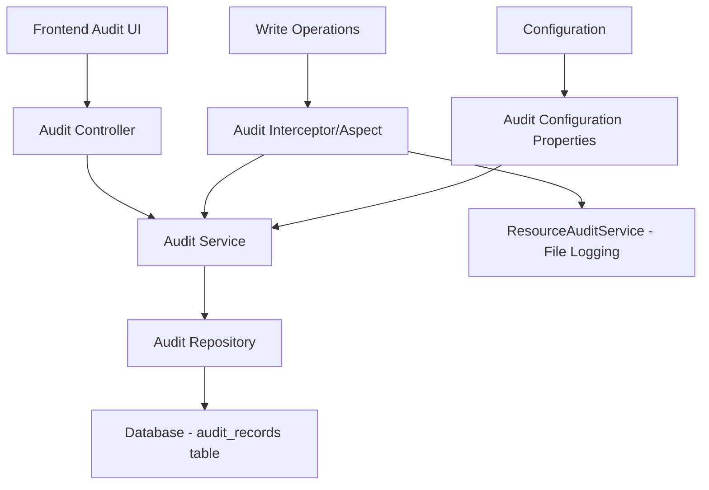

# Design Document

## Overview

The RabbitMQ Write Audit feature extends the existing audit logging capabilities to provide comprehensive database-backed audit trails for all write operations performed on RabbitMQ clusters. The system will capture detailed information about write operations, store them persistently in the database, and provide a dedicated administrative interface for viewing and filtering audit records.

The design leverages the existing ResourceAuditService for logging but adds a new persistent audit storage layer with database entities, repositories, and a complete UI for audit record management. The feature will be configurable and follow the established architectural patterns of the application.

## Architecture

### High-Level Architecture



### Component Integration

The audit system integrates with existing components:

- **Write Operations**: All existing write operations (exchanges, queues, bindings, messages) will be intercepted
- **Security Layer**: Leverages existing JWT authentication and role-based authorization
- **Database Layer**: Uses existing Flyway migration system and JPA repositories
- **Frontend**: Follows existing UI patterns with Material-UI components and React hooks
- **Configuration**: Extends existing application.yml configuration structure

## Components and Interfaces

### Backend Components

#### 1. Data Model

**AuditRecord Entity**

```java
@Entity
@Table(name = "audit_records")
public class AuditRecord {
    @Id
    @GeneratedValue(strategy = GenerationType.UUID)
    private UUID id;

    @ManyToOne(fetch = FetchType.LAZY)
    @JoinColumn(name = "user_id", nullable = false)
    private User user;

    @ManyToOne(fetch = FetchType.LAZY)
    @JoinColumn(name = "cluster_id", nullable = false)
    private ClusterConnection cluster;

    @Enumerated(EnumType.STRING)
    @Column(nullable = false)
    private AuditOperationType operationType;

    @Column(nullable = false, length = 100)
    private String resourceType; // exchange, queue, binding, message

    @Column(nullable = false, length = 500)
    private String resourceName;

    @Column(columnDefinition = "TEXT")
    private String resourceDetails; // JSON string with operation-specific details

    @Enumerated(EnumType.STRING)
    @Column(nullable = false)
    private AuditOperationStatus status; // SUCCESS, FAILURE, PARTIAL

    @Column(length = 1000)
    private String errorMessage;

    @Column(nullable = false)
    private Instant timestamp;

    @Column(length = 45)
    private String clientIp;

    @Column(length = 100)
    private String userAgent;
}
```

**AuditOperationType Enum**

```java
public enum AuditOperationType {
    CREATE_EXCHANGE,
    DELETE_EXCHANGE,
    CREATE_QUEUE,
    DELETE_QUEUE,
    PURGE_QUEUE,
    CREATE_BINDING_EXCHANGE,
    CREATE_BINDING_QUEUE,
    DELETE_BINDING,
    PUBLISH_MESSAGE_EXCHANGE,
    PUBLISH_MESSAGE_QUEUE,
    MOVE_MESSAGES_QUEUE
}
```

#### 2. Repository Layer

**AuditRecordRepository**

```java
@Repository
public interface AuditRecordRepository extends JpaRepository<AuditRecord, UUID> {
    Page<AuditRecord> findByUserUsernameContainingIgnoreCase(String username, Pageable pageable);
    Page<AuditRecord> findByClusterName(String clusterName, Pageable pageable);
    Page<AuditRecord> findByOperationType(AuditOperationType operationType, Pageable pageable);
    Page<AuditRecord> findByTimestampBetween(Instant startTime, Instant endTime, Pageable pageable);
    Page<AuditRecord> findByResourceNameContainingIgnoreCase(String resourceName, Pageable pageable);

    // Complex filtering method
    @Query("SELECT a FROM AuditRecord a WHERE " +
           "(:username IS NULL OR LOWER(a.user.username) LIKE LOWER(CONCAT('%', :username, '%'))) AND " +
           "(:clusterName IS NULL OR LOWER(a.cluster.name) LIKE LOWER(CONCAT('%', :clusterName, '%'))) AND " +
           "(:operationType IS NULL OR a.operationType = :operationType) AND " +
           "(:resourceName IS NULL OR LOWER(a.resourceName) LIKE LOWER(CONCAT('%', :resourceName, '%'))) AND " +
           "(:startTime IS NULL OR a.timestamp >= :startTime) AND " +
           "(:endTime IS NULL OR a.timestamp <= :endTime)")
    Page<AuditRecord> findWithFilters(@Param("username") String username,
                                     @Param("clusterName") String clusterName,
                                     @Param("operationType") AuditOperationType operationType,
                                     @Param("resourceName") String resourceName,
                                     @Param("startTime") Instant startTime,
                                     @Param("endTime") Instant endTime,
                                     Pageable pageable);
}
```

#### 3. Service Layer

**WriteAuditService**

```java
@Service
@ConditionalOnProperty(name = "app.audit.write-operations.enabled", havingValue = "true", matchIfMissing = false)
public class WriteAuditService {
    private final AuditRecordRepository auditRepository;
    private final ResourceAuditService resourceAuditService; // For file logging

    public void auditWriteOperation(User user, ClusterConnection cluster,
                                   AuditOperationType operationType, String resourceType,
                                   String resourceName, Map<String, Object> details,
                                   AuditOperationStatus status, String errorMessage);

    public Page<AuditRecordDto> getAuditRecords(AuditFilterRequest filterRequest, Pageable pageable);
}
```

#### 4. Controller Layer

**AuditController**

```java
@RestController
@RequestMapping("/api/audit")
@PreAuthorize("hasRole('ADMINISTRATOR')")
public class AuditController {

    @GetMapping("/records")
    public ResponseEntity<PagedResponse<AuditRecordDto>> getAuditRecords(
        @Valid AuditFilterRequest filterRequest,
        @RequestParam(defaultValue = "0") int page,
        @RequestParam(defaultValue = "50") int pageSize,
        @RequestParam(defaultValue = "timestamp") String sortBy,
        @RequestParam(defaultValue = "desc") String sortDirection);
}
```

#### 5. DTOs

**AuditRecordDto**

```java
public class AuditRecordDto {
    private UUID id;
    private String username;
    private String clusterName;
    private AuditOperationType operationType;
    private String resourceType;
    private String resourceName;
    private Map<String, Object> resourceDetails;
    private AuditOperationStatus status;
    private String errorMessage;
    private Instant timestamp;
    private String clientIp;
}
```

**AuditFilterRequest**

```java
public class AuditFilterRequest {
    private String username;
    private String clusterName;
    private AuditOperationType operationType;
    private String resourceName;
    private Instant startTime;
    private Instant endTime;
}
```

#### 6. Aspect/Interceptor

**WriteOperationAuditAspect**

```java
@Aspect
@Component
@ConditionalOnProperty(name = "app.audit.write-operations.enabled", havingValue = "true")
public class WriteOperationAuditAspect {

    @Around("@annotation(AuditWriteOperation)")
    public Object auditWriteOperation(ProceedingJoinPoint joinPoint) throws Throwable;
}
```

### Frontend Components

#### 1. Pages and Components

**AuditPage Component**

- Main audit records page following existing resource page patterns
- Integrates with existing layout and navigation
- Includes filtering, pagination, and sorting capabilities
- Added to navbar under Management group with "Audits" label and appropriate audit/history icon

**AuditRecordsList Component**

- Table component displaying audit records
- Uses existing ResourceTable patterns
- Supports column sorting and row selection

**AuditFilters Component**

- Filter panel with date range, user, cluster, operation type filters
- Uses existing SearchAndFilter component patterns

#### 2. Hooks and Services

**useAuditRecords Hook**

- Manages audit records fetching and state
- Follows existing resource hooks patterns
- Supports filtering, pagination, and auto-refresh

**auditApi Service**

- API client for audit endpoints
- Follows existing API service patterns

#### 3. Types and Interfaces

**TypeScript Interfaces**

```typescript
interface AuditRecord {
  id: string;
  username: string;
  clusterName: string;
  operationType: AuditOperationType;
  resourceType: string;
  resourceName: string;
  resourceDetails: Record<string, any>;
  status: AuditOperationStatus;
  errorMessage?: string;
  timestamp: string;
  clientIp?: string;
}

interface AuditFilterRequest {
  username?: string;
  clusterName?: string;
  operationType?: AuditOperationType;
  resourceName?: string;
  startTime?: string;
  endTime?: string;
}
```

## Data Models

### Database Schema

**audit_records Table**

```sql
CREATE TABLE audit_records (
    id UUID PRIMARY KEY DEFAULT gen_random_uuid(),
    user_id UUID NOT NULL REFERENCES users(id),
    cluster_id UUID NOT NULL REFERENCES cluster_connections(id),
    operation_type VARCHAR(50) NOT NULL,
    resource_type VARCHAR(100) NOT NULL,
    resource_name VARCHAR(500) NOT NULL,
    resource_details TEXT,
    status VARCHAR(20) NOT NULL,
    error_message VARCHAR(1000),
    timestamp TIMESTAMP WITH TIME ZONE NOT NULL,
    client_ip VARCHAR(45),
    user_agent VARCHAR(100),
    created_at TIMESTAMP WITH TIME ZONE DEFAULT CURRENT_TIMESTAMP
);

CREATE INDEX idx_audit_records_user_id ON audit_records(user_id);
CREATE INDEX idx_audit_records_cluster_id ON audit_records(cluster_id);
CREATE INDEX idx_audit_records_timestamp ON audit_records(timestamp);
CREATE INDEX idx_audit_records_operation_type ON audit_records(operation_type);
CREATE INDEX idx_audit_records_resource_name ON audit_records(resource_name);
CREATE INDEX idx_audit_records_composite ON audit_records(user_id, cluster_id, timestamp);
```

### Configuration Schema

**Application Configuration Extension**

```yaml
app:
  audit:
    write-operations:
      enabled: ${AUDIT_WRITE_OPERATIONS_ENABLED:false}
      retention-days: ${AUDIT_RETENTION_DAYS:90}
      batch-size: ${AUDIT_BATCH_SIZE:100}
      async-processing: ${AUDIT_ASYNC_PROCESSING:true}
```

## Error Handling

### Backend Error Handling

1. **Audit Service Failures**: Audit failures should not prevent write operations from completing
2. **Database Connectivity**: Graceful degradation when audit database is unavailable
3. **Configuration Errors**: Clear error messages for misconfiguration
4. **Permission Errors**: Proper HTTP status codes for unauthorized access

### Frontend Error Handling

1. **API Failures**: User-friendly error messages using existing error handling patterns
2. **Loading States**: Proper loading indicators during data fetching
3. **Empty States**: Clear messaging when no audit records are found
4. **Filter Validation**: Client-side validation for filter inputs

## Testing Strategy

### Backend Testing

1. **Unit Tests**

   - AuditRecord entity validation
   - WriteAuditService business logic
   - AuditController endpoint behavior
   - Repository query methods

2. **Integration Tests**

   - Database operations with test containers
   - Aspect interception of write operations
   - End-to-end audit flow testing
   - Configuration property testing

3. **Performance Tests**
   - Audit record insertion performance
   - Query performance with large datasets
   - Impact on write operation performance

### Frontend Testing

1. **Component Tests**

   - AuditPage rendering and interaction
   - AuditFilters functionality
   - AuditRecordsList display and sorting

2. **Hook Tests**

   - useAuditRecords data fetching
   - Filter state management
   - Pagination behavior

3. **Integration Tests**
   - API integration testing
   - Error handling scenarios
   - User permission enforcement

### Security Testing

1. **Authorization Tests**

   - Admin-only access enforcement
   - JWT token validation
   - Role-based access control

2. **Data Security Tests**
   - Audit record immutability
   - Sensitive data handling
   - SQL injection prevention

## Performance Considerations

### Database Performance

1. **Indexing Strategy**: Comprehensive indexes on frequently queried columns
2. **Partitioning**: Consider table partitioning for large audit datasets
3. **Archival Strategy**: Automated cleanup of old audit records based on retention policy

### Application Performance

1. **Async Processing**: Audit operations should not block write operations
2. **Batch Processing**: Batch audit record insertions for better performance
3. **Caching**: Cache frequently accessed audit metadata

### Frontend Performance

1. **Pagination**: Efficient pagination to handle large audit datasets
2. **Virtual Scrolling**: Consider virtual scrolling for large result sets
3. **Debounced Filtering**: Debounce filter inputs to reduce API calls

## Security Considerations

1. **Access Control**: Strict admin-only access to audit records
2. **Data Integrity**: Audit records should be immutable once created
3. **Sensitive Data**: Careful handling of sensitive information in audit details
4. **Audit Trail**: The audit system itself should be auditable
5. **Retention Policy**: Configurable retention with secure deletion of old records
