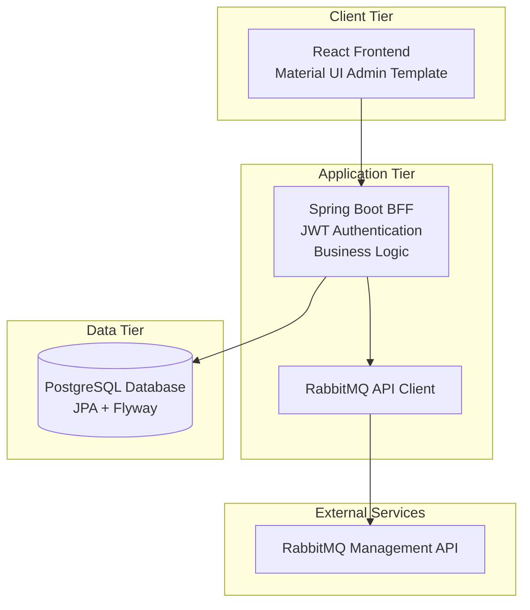

# RabbitMQ Admin Dashboard

A comprehensive web application for managing RabbitMQ clusters with authentication, authorization, and multi-cluster support.

## 📑 Table of Contents

- [🚀 Features](#-features)
- [📋 Prerequisites](#-prerequisites)
- [🏃‍♂️ Quick Start](#️-quick-start)
  - [Option 1: Docker (Recommended)](#option-1-docker-recommended)
  - [Option 2: Standalone JAR](#option-2-standalone-jar)
  - [Option 3: Development Setup](#option-3-development-setup)
- [🏗️ Project Structure](#️-project-structure)
- [🛠️ CLI Tool](#️-cli-tool)
  - [Quick Start](#quick-start)
  - [Available Commands](#available-commands)
  - [Build Options](#build-options)
  - [Deploy Options](#deploy-options)
- [🔧 Configuration](#-configuration)
  - [Environment Variables](#environment-variables)
  - [Security Configuration](#security-configuration)
- [🔐 Default Credentials](#-default-credentials)
- [🛠️ Build & Deployment](#️-build--deployment)
  - [Build Commands](#build-commands)
  - [Deployment Commands](#deployment-commands)
- [🧪 Testing](#-testing)
  - [Run Tests](#run-tests)
  - [Test Coverage](#test-coverage)
- [📊 Monitoring & Health Checks](#-monitoring--health-checks)
  - [Health Endpoints](#health-endpoints)
  - [Custom Health Checks](#custom-health-checks)
- [🔒 Security Features](#-security-features)
  - [Application Security](#application-security)
  - [Container Security](#container-security)
  - [Database Security](#database-security)
- [🚀 Production Deployment](#-production-deployment)
  - [Pre-deployment Checklist](#pre-deployment-checklist)
  - [Production Environment](#production-environment)
- [📝 API Documentation](#-api-documentation)
  - [Authentication Endpoints](#authentication-endpoints)
  - [User Management](#user-management-admin-only)
  - [Cluster Management](#cluster-management-admin-only)
  - [RabbitMQ Proxy](#rabbitmq-proxy)
- [📦 Versioning](#-versioning)
  - [Version Management](#version-management)
  - [Version Commands](#version-commands)
  - [Version Display](#version-display)
  - [Changing Version](#changing-version)
- [🏛️ Architecture & Design](#️-architecture--design)
- [🤝 Contributing](#-contributing)
  - [Development Guidelines](#development-guidelines)
- [📄 License](#-license)
- [🆘 Troubleshooting](#-troubleshooting)
  - [Common Issues](#common-issues)
  - [Getting Help](#getting-help)
- [📞 Support](#-support)

## 🚀 Features

- **Authentication & Authorization**: JWT-based authentication with role-based access control
- **Multi-Cluster Management**: Connect and manage multiple RabbitMQ clusters simultaneously
- **Modern UI**: React 18+ with Material UI v5 and responsive design
- **Secure Backend**: Spring Boot 3.x with Spring Security and comprehensive validation
- **Database Management**: PostgreSQL with Flyway migrations and connection pooling
- **Containerization**: Full Docker support with production-ready configurations
- **Comprehensive Testing**: Unit, integration, and end-to-end tests
- **Production Ready**: Health checks, monitoring, logging, and security configurations

## 📋 Prerequisites

### Development

- **Java 21+** (OpenJDK or Oracle JDK)
- **Node.js 20+** with npm
- **PostgreSQL 15+**
- **Maven 3.9+**

### Production (Docker)

- **Docker 24+**
- **Docker Compose 2.0+**

## 🏃‍♂️ Quick Start

### Option 1: Docker (Recommended)

**Using published image:**

```bash
docker run -d \
  --name rabbitmq-admin \
  -p 8080:8080 \
  -e SPRING_DATASOURCE_URL=jdbc:postgresql://your-db:5432/rabbitmq_admin \
  -e SPRING_DATASOURCE_USERNAME=your_user \
  -e SPRING_DATASOURCE_PASSWORD=your_password \
  -e JWT_SECRET_KEY=your-secret-key \
  username/rabbitmq-admin:latest
```

**Local development with database:**

```bash
git clone <repository-url>
cd rabbitmq-admin
./radmin-cli build dev
```

Access at http://localhost:8080

### Option 2: Standalone JAR

1. **Download or build JAR:**

```bash
# Build locally
./radmin-cli build jar

# Or download from GitHub releases
```

2. **Run with external database:**

```bash
export SPRING_DATASOURCE_URL=jdbc:postgresql://localhost:5432/rabbitmq_admin
export SPRING_DATASOURCE_USERNAME=your_user
export SPRING_DATASOURCE_PASSWORD=your_password
export JWT_SECRET_KEY=your-secret-key

java -jar rabbitmq-admin-backend-*.jar
```

# Build everything

./radmin-cli build dev

# Run backend

mvn spring-boot:run -pl backend -Dspring.profiles.active=local

# Run frontend (in another terminal)

cd frontend && npm start

````

## 🏗️ Project Structure

The project is organized into several key directories, each serving a specific purpose:

### 📁 Core Application

| Directory | Description |
|-----------|-------------|
| `backend/` | Spring Boot application with REST API |
| `├── src/main/java/` | Java source code and business logic |
| `├── src/main/resources/` | Configuration files and database migrations |
| `└── src/test/` | Backend unit and integration tests |
| `frontend/` | React TypeScript application |
| `├── src/` | Frontend source code and components |
| `├── public/` | Static assets and HTML template |
| `└── build/` | Built frontend assets (generated) |

### 📋 Documentation & Design

| Directory | Description |
|-----------|-------------|
| `design/` | Architecture and design documentation |
| `├── architecture/` | System architecture diagrams and documentation |
| `├── api/` | API design specifications and examples |
| `├── database/` | Database schema and migration documentation |
| `├── security/` | Security design and implementation details |
| `└── testing/` | Testing strategy and coverage documentation |

### 🐳 Infrastructure & Deployment

| Directory | Description |
|-----------|-------------|
| `docker/` | Docker configuration and containerization |
| `├── Dockerfile` | Multi-stage build configuration |
| `├── docker-compose.yml` | Development environment setup |
| `├── docker-compose.prod.yml` | Production environment overrides |
| `└── scripts/` | Container deployment scripts |
| `scripts/` | Build and deployment automation |
| `├── build.sh` | Application build automation |
| `├── run.sh` | Application runtime scripts |
| `├── deploy.sh` | Production deployment automation |
| `└── sync-versions.sh` | Version synchronization utility |

### 🔧 Development Tools

| Directory | Description |
|-----------|-------------|
| `.github/workflows/` | CI/CD pipeline configurations |
| `radmin-cli` | Unified command-line interface tool |
| `generate-hash.sh` | BCrypt password hash generation utility |
| `README.md` | Project documentation (this file) |

## 🛠️ CLI Tool

The project includes a unified CLI tool `radmin-cli` (RabbitMQ Admin CLI) for all operations:

### Quick Start

```bash
# Show help and available commands
./radmin-cli help

# Build standalone JAR
./radmin-cli build jar

# Start development environment
./radmin-cli build dev

# Run with Docker Compose
./radmin-cli run docker

# Deploy to production
./radmin-cli deploy run --db-url jdbc:postgresql://db:5432/rabbitmq_admin \
                        --db-user admin --db-pass secret --jwt-secret my-secret
````

### Available Commands

#### Build Commands

```bash
./radmin-cli build jar          # Build standalone JAR
./radmin-cli build docker       # Build Docker image
./radmin-cli build dev          # Start development environment
./radmin-cli build clean        # Clean build artifacts
./radmin-cli build test         # Run all tests
```

#### Run Commands

```bash
./radmin-cli run jar            # Run JAR (requires external DB)
./radmin-cli run docker         # Run with Docker Compose
./radmin-cli run container      # Run published container
```

#### Deploy Commands

```bash
./radmin-cli deploy run         # Deploy container
./radmin-cli deploy stop        # Stop container
./radmin-cli deploy logs        # View logs
./radmin-cli deploy status      # Check status
```

#### Version Commands

```bash
./radmin-cli version            # Show current version
./radmin-cli version sync       # Sync versions across components
```

#### Utility Commands

```bash
./generate-hash.sh              # Generate BCrypt hash for admin password
```

### Build Options

```bash
--skip-tests                    # Skip running tests during build
--no-cache                      # Don't use Docker build cache
--tag TAG                       # Docker image tag (default: latest)
```

### Deploy Options

```bash
--image IMAGE                   # Docker image (default: rabbitmq-admin:latest)
--port PORT                     # Application port (default: 8080)
--db-url URL                    # Database URL (required)
--db-user USER                  # Database username (required)
--db-pass PASS                  # Database password (required)
--jwt-secret KEY                # JWT secret key (required)
--name NAME                     # Container name (default: rabbitmq-admin)
```

## 🔧 Configuration

### Environment Variables

| Variable                 | Description       | Default          | Required |
| ------------------------ | ----------------- | ---------------- | -------- |
| `POSTGRES_DB`            | Database name     | `rabbitmq_admin` | No       |
| `POSTGRES_USER`          | Database user     | `rabbitmq_admin` | No       |
| `POSTGRES_PASSWORD`      | Database password | `password`       | **Yes**  |
| `JWT_SECRET_KEY`         | JWT signing key   | _default_        | **Yes**  |
| `SPRING_PROFILES_ACTIVE` | Spring profiles   | `docker`         | No       |
| `JAVA_OPTS`              | JVM options       | _optimized_      | No       |

### Security Configuration

⚠️ **Important**: Change these values in production:

1. **JWT Secret Key**: Generate a secure 256-bit key
2. **Database Password**: Use a strong, unique password
3. **Admin Credentials**: Change default admin password

## 🔐 Default Credentials

- **Username**: `admin`
- **Password**: `admin123!`

**⚠️ Change these immediately in production!**

### Password Hash Generation

For development and testing purposes, you can generate BCrypt password hashes using the built-in utility:

```bash
# Generate hash for the default password
java -jar rabbitmq-admin-backend-*.jar generate-hash

# Or during development
mvn spring-boot:run -pl backend -Dspring-boot.run.arguments=generate-hash
```

This utility generates a BCrypt hash for the default password and verifies it matches the expected format used in database migrations.

## 🛠️ Build & Deployment

### Build Commands

```bash
# Development build
./radmin-cli build dev

# Production build
./radmin-cli build jar

# Docker image
./radmin-cli build docker --tag v1.0.0

# Clean build artifacts
./radmin-cli build clean
```

**Build Process Notes:**

- The build automatically cleans old static resources before copying new frontend assets
- Frontend build artifacts are copied to Spring Boot's static resources directory
- Enhanced resource copying ensures proper overwrite of existing files
- Static resources are excluded from Maven filtering to prevent modification during build

### Deployment Commands

```bash
# Local deployment
./deploy.sh local

# Production deployment
./deploy.sh production --tag v1.0.0

# Check status
./deploy.sh status

# View logs
./deploy.sh logs

# Create backup
./deploy.sh backup
```

## 🧪 Testing

### Run Tests

```bash
# All tests
./radmin-cli build test

# Backend only
mvn test -pl backend

# Frontend only
cd frontend && npm test
```

### Test Coverage

- **Backend**: JUnit 5, Mockito, TestContainers with optimized Surefire configuration
- **Frontend**: Vitest, React Testing Library
- **Integration**: Docker Compose with real services
- **Test Isolation**: Enhanced configuration for reliable CI/CD execution
- **Testing Framework**: Uses modern `@MockitoBean` annotation (migrated from deprecated `@MockBean` in Spring Boot 3.4.0+)

## 📊 Monitoring & Health Checks

### Health Endpoints

- **Application Health**: `GET /actuator/health`
- **Application Info**: `GET /actuator/info`
- **Metrics**: `GET /actuator/metrics` (if enabled)

### Custom Health Checks

```bash
# Manual health check
docker exec rabbitmq-admin-app /app/healthcheck.sh

# Application logs
docker logs rabbitmq-admin-app

# Database logs
docker logs rabbitmq-admin-db
```

## 🔒 Security Features

### Application Security

- JWT authentication with configurable expiration
- Role-based access control (RBAC)
- Hybrid security model: API endpoints protected server-side, frontend routes protected client-side
- Input validation and sanitization
- SQL injection prevention
- XSS protection with CSP headers

### Container Security

- Non-root user execution
- Read-only root filesystem (production)
- Resource limits and reservations
- Security options (no-new-privileges)
- Minimal attack surface

### Database Security

- SCRAM-SHA-256 authentication
- Connection encryption
- Credential management
- Connection pooling with limits

## 🚀 Production Deployment

### Pre-deployment Checklist

- [ ] Change default passwords
- [ ] Set secure JWT secret key
- [ ] Configure proper resource limits
- [ ] Set up log rotation
- [ ] Configure monitoring
- [ ] Test backup and restore procedures
- [ ] Verify security settings
- [ ] Test health checks
- [ ] Configure reverse proxy (if needed)
- [ ] Set up SSL/TLS certificates

### Production Environment

```bash
# 1. Prepare environment
cp docker/.env.example docker/.env.prod
# Edit .env.prod with production values

# 2. Deploy
./deploy.sh production --env-file .env.prod

# 3. Verify deployment
./deploy.sh status
curl -f http://localhost:8080/actuator/health
```

## 📝 API Documentation

### Authentication Endpoints

- `POST /api/auth/login` - User login
- `POST /api/auth/logout` - User logout
- `GET /api/auth/me` - Current user info

### User Management (Admin Only)

- `GET /api/users` - List users
- `POST /api/users` - Create user
- `PUT /api/users/{id}` - Update user
- `DELETE /api/users/{id}` - Delete user

### Cluster Management (Admin Only)

- `GET /api/clusters` - List cluster connections
- `POST /api/clusters` - Create cluster connection
- `PUT /api/clusters/{id}` - Update cluster connection
- `DELETE /api/clusters/{id}` - Delete cluster connection
- `POST /api/clusters/test` - Test new connection (before creating)
- `POST /api/clusters/{id}/test` - Test existing cluster connection

### RabbitMQ Proxy

- `GET /api/rabbitmq/{clusterId}/*` - Proxy to RabbitMQ Management API

### Debug Endpoints (Development Only)

- `GET /api/debug/hash?password=<password>` - Generate BCrypt hash for password (requires authentication)
- `GET /api/debug/verify?password=<password>&hash=<hash>` - Verify password against hash (requires authentication)

⚠️ **Security Note**: Debug endpoints require valid JWT authentication and are intended for development use only. They should be disabled or secured in production environments.

## 📦 Versioning

This project uses a unified versioning system where the main `pom.xml` serves as the single source of truth for all components.

### Version Management

- **Single Source**: Version defined in root `pom.xml`
- **Automatic Sync**: All components (frontend, backend, Docker) use the same version
- **Build Integration**: Version automatically injected during build process
- **Runtime Display**: Version shown in UI footer and login page

### Version Commands

```bash
# Sync all component versions from main pom.xml
./radmin-cli version sync

# Build with version tagging (automatically syncs versions)
./radmin-cli build jar    # Creates JAR with version in filename
./radmin-cli build docker # Creates Docker image with version tag
```

### Version Display

- **Frontend**: Version appears in footer and login page
- **Backend**: Available via `/api/version` endpoint
- **Docker**: Images tagged with project version
- **CI/CD**: Artifacts named with version numbers

### Changing Version

```bash
# Update version in main pom.xml
mvn versions:set -DnewVersion=2.0.0

# Sync to all components
./radmin-cli version sync

# Commit changes
git add .
git commit -m "chore: bump version to 2.0.0"
git tag v2.0.0
```

## 🏛️ Architecture & Design

RabbitMQ Admin is a three-tier web application that provides a comprehensive administrative interface for managing RabbitMQ clusters. The application implements role-based access control with JWT authentication and follows modern web development practices.

### System Architecture



### Technology Stack

**Frontend:**

- React 18+ with Material UI v5
- TypeScript for type safety
- Vite for fast development and building
- React Router for client-side routing

**Backend:**

- Java 21 with Spring Boot 3.x
- Spring Security for authentication and authorization
- Spring Data JPA for data access
- Spring WebFlux for RabbitMQ API client
- JWT for stateless authentication

**Database:**

- PostgreSQL 15+ for data persistence
- Flyway for database migrations
- HikariCP for connection pooling

**Infrastructure:**

- Docker and Docker Compose for containerization
- Maven for backend build management
- pnpm for frontend dependency management

### Key Features

- **Multi-Cluster Support**: Dynamic client pool for multiple RabbitMQ clusters
- **Role-Based Security**: Admin and User roles with resource-level access control
- **Stateless Design**: JWT-based authentication for horizontal scaling
- **Modern UI**: Responsive React interface with Material UI components
- **Production Ready**: Health checks, monitoring, logging, and security configurations

### Security Architecture

- **Authentication**: Stateless JWT tokens with configurable expiration
- **Authorization**: Role-based access control with method-level security
- **Data Protection**: Input validation, SQL injection prevention, XSS protection
- **Token Management**: Simplified approach with centralized authentication logic

## 🤝 Contributing

1. Fork the repository
2. Create a feature branch
3. Make your changes
4. Add tests for new functionality
5. Ensure all tests pass
6. Submit a pull request

### Development Guidelines

- Follow Java and TypeScript coding standards
- Write comprehensive tests
- Update documentation
- Use conventional commit messages
- Ensure security best practices

## 📄 License

This project is licensed under the MIT License - see the LICENSE file for details.

## 🆘 Troubleshooting

### Common Issues

1. **Port 5432 already in use (PostgreSQL conflict)**

   ```bash
   # Error: "bind: address already in use"
   # Solution: Use different port in docker/.env
   POSTGRES_PORT=5433

   # Then restart development environment
   ./radmin-cli build dev
   ```

2. **Database connection failed**

   ```bash
   # Check database container
   docker logs rabbitmq-admin-db

   # Verify environment variables
   docker exec rabbitmq-admin-app env | grep DB_
   ```

3. **Application startup timeout**

   ```bash
   # Check application logs
   docker logs rabbitmq-admin-app

   # Increase health check timeout
   # Edit docker-compose.yml healthcheck settings
   ```

4. **Frontend build failures**

   ```bash
   # Clear pnpm cache
   cd frontend && pnpm store prune

   # Reinstall dependencies (force reinstall if needed)
   rm -rf node_modules pnpm-lock.yaml
   pnpm install --force

   # If static resources aren't updating properly
   # The build now automatically cleans old static resources
   # But you can manually clean if needed:
   mvn clean -pl backend
   ```

5. **Dependency resolution conflicts**

   ```bash
   # The build now uses --force flag for pnpm install to resolve conflicts
   # If you encounter dependency issues during development:

   # Option 1: Use force flag (matches build configuration)
   pnpm install --force

   # Option 2: Clear cache and reinstall
   pnpm store prune
   rm -rf node_modules
   pnpm install --force
   ```

6. **Test execution timeouts or failures**

   ```bash
   # Run tests with increased verbosity
   mvn test -pl backend -X

   # Skip tests for build if needed
   mvn package -pl backend -DskipTests

   # Run specific test class
   mvn test -pl backend -Dtest=UserServiceTest

   # Clean test containers and retry
   docker system prune -f
   mvn clean test -pl backend
   ```

### Getting Help

- Check the [Issues](../../issues) page for known problems
- Review logs using `./deploy.sh logs`
- Run health checks with `./deploy.sh status`
- Check the [Wiki](../../wiki) for detailed documentation

## 📞 Support

For support and questions:

- Create an issue in the repository
- Check existing documentation
- Review the troubleshooting section
