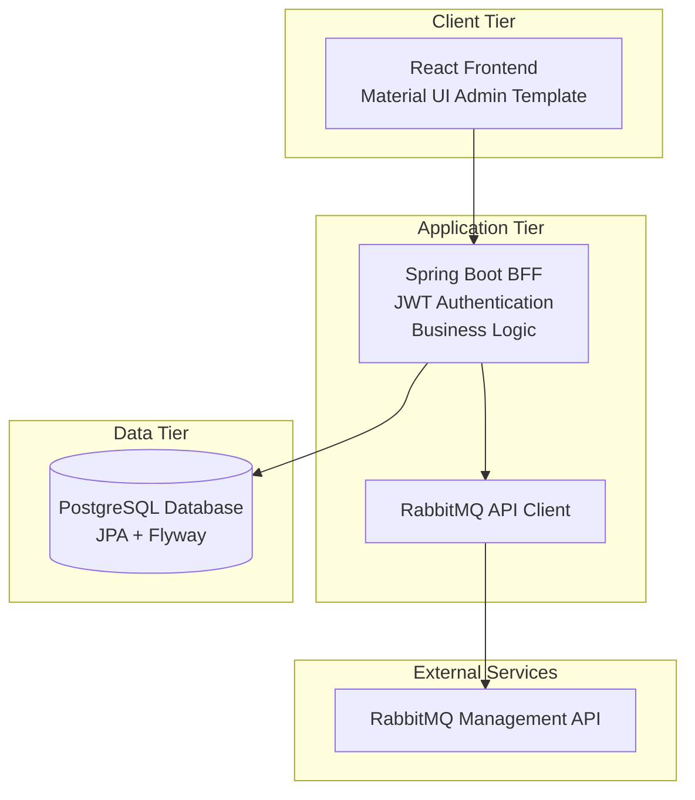

# RabbitMQ Admin

A comprehensive web application for managing RabbitMQ clusters with authentication, authorization, and multi-cluster support.

## 📑 Table of Contents

- [🚀 Features](#-features)
- [📋 Prerequisites](#-prerequisites)
- [🏃‍♂️ Quick Start](#️-quick-start)
  - [Option 1: Docker (Recommended)](#option-1-docker-recommended)
  - [Option 2: Standalone JAR](#option-2-standalone-jar)
  - [Option 3: Development Setup](#option-3-development-setup)
- [🏗️ Project Structure](#️-project-structure)
- [🛠️ CLI Tool](#️-cli-tool)
  - [Quick Start](#quick-start)
  - [Available Commands](#available-commands)
  - [Build Options](#build-options)
  - [Deploy Options](#deploy-options)
- [🔧 Configuration](#-configuration)
  - [Environment Variables](#environment-variables)
  - [Security Configuration](#security-configuration)
- [🔐 Default Credentials](#-default-credentials)
- [🛠️ Build & Deployment](#️-build--deployment)
  - [Build Commands](#build-commands)
  - [Deployment Commands](#deployment-commands)
- [🧪 Testing](#-testing)
  - [Run Tests](#run-tests)
  - [Test Coverage](#test-coverage)
- [📊 Monitoring & Health Checks](#-monitoring--health-checks)
  - [Health Endpoints](#health-endpoints)
  - [Custom Health Checks](#custom-health-checks)
- [🔒 Security Features](#-security-features)
  - [Application Security](#application-security)
  - [Container Security](#container-security)
  - [Database Security](#database-security)
- [🚀 Production Deployment](#-production-deployment)
  - [Pre-deployment Checklist](#pre-deployment-checklist)
  - [Production Environment](#production-environment)
- [📝 API Documentation](#-api-documentation)
  - [Authentication Endpoints](#authentication-endpoints)
  - [User Management](#user-management-admin-only)
  - [Cluster Management](#cluster-management-admin-only)
  - [RabbitMQ Resource Management](#rabbitmq-resource-management)
  - [RabbitMQ Proxy](#rabbitmq-proxy)
- [📦 Versioning](#-versioning)
  - [Version Management](#version-management)
  - [Version Commands](#version-commands)
  - [Version Display](#version-display)
  - [Changing Version](#changing-version)
- [🏛️ Architecture & Design](#️-architecture--design)
- [🤝 Contributing](#-contributing)
  - [Development Guidelines](#development-guidelines)
- [📄 License](#-license)
- [🆘 Troubleshooting](#-troubleshooting)
  - [Common Issues](#common-issues)
  - [Getting Help](#getting-help)
- [📞 Support](#-support)

## 🚀 Features

- **Authentication & Authorization**: JWT-based authentication with role-based access control and automatic token expiration handling
- **Multi-Cluster Management**: Connect and manage multiple RabbitMQ clusters with user assignment controls
- **RabbitMQ Resource Browsing**: View connections, channels, exchanges, and queues with advanced pagination, filtering, detailed tooltips, intelligent client-side caching with configurable TTL, and enhanced error handling with automatic recovery
- **Intuitive Navigation**: Collapsible resource management menu with cluster-aware access control, visual state indicators, breadcrumb navigation, and direct URL access to resource pages
- **TypeScript Support**: Comprehensive type definitions for all RabbitMQ resources with full IntelliSense support
- **Modern UI**: React 18+ with Material UI v5 and responsive design
- **Secure Backend**: Spring Boot 3.x with Spring Security and comprehensive validation
- **Database Management**: PostgreSQL with Flyway migrations and connection pooling
- **Containerization**: Full Docker support with production-ready configurations
- **Comprehensive Testing**: Unit, integration, and end-to-end tests (E2E for local development only)
- **Production Ready**: Health checks, monitoring, logging, and security configurations

## 📋 Prerequisites

### Development

- **Java 21+** (OpenJDK or Oracle JDK)
- **Node.js 20+** with npm
- **PostgreSQL 15+**
- **Maven 3.9+**

### Production (Docker)

- **Docker 24+**
- **Docker Compose 2.0+**

## 🏃‍♂️ Quick Start

### Option 1: Docker (Recommended)

**Using published image:**

```bash
docker run -d \
  --name rabbitmq-admin \
  -p 8080:8080 \
  -e SPRING_DATASOURCE_URL=jdbc:postgresql://your-db:5432/rabbitmq_admin \
  -e SPRING_DATASOURCE_USERNAME=your_user \
  -e SPRING_DATASOURCE_PASSWORD=your_password \
  -e JWT_SECRET_KEY=your-secret-key \
  -e RABBITMQ_ADMIN_RESOURCES_CACHE_ENABLED=true \
  -e RABBITMQ_ADMIN_RESOURCES_RATE_LIMIT_REQUESTS_PER_MINUTE=60 \
  username/rabbitmq-admin:latest
```

**Local development with database:**

```bash
git clone <repository-url>
cd rabbitmq-admin
./radmin-cli build dev
```

Access at http://localhost:8080

### Option 2: Standalone JAR

1. **Download or build JAR:**

```bash
# Build locally
./radmin-cli build jar

# Or download from GitHub releases
```

2. **Run with external database:**

```bash
export SPRING_DATASOURCE_URL=jdbc:postgresql://localhost:5432/rabbitmq_admin
export SPRING_DATASOURCE_USERNAME=your_user
export SPRING_DATASOURCE_PASSWORD=your_password
export JWT_SECRET_KEY=your-secret-key
export RABBITMQ_ADMIN_RESOURCES_CACHE_ENABLED=true
export RABBITMQ_ADMIN_RESOURCES_RATE_LIMIT_REQUESTS_PER_MINUTE=60

java -jar rabbitmq-admin-backend-*.jar
```

# Build everything

./radmin-cli build dev

# Run backend

mvn spring-boot:run -pl backend -Dspring.profiles.active=local

# Run frontend (in another terminal)

cd frontend && npm start

````

## 🏗️ Project Structure

The project is organized into several key directories, each serving a specific purpose:

### 📁 Core Application

| Directory | Description |
|-----------|-------------|
| `backend/` | Spring Boot application with REST API |
| `├── src/main/java/` | Java source code and business logic |
| `├── src/main/resources/` | Configuration files and database migrations |
| `└── src/test/` | Backend unit and integration tests |
| `frontend/` | React TypeScript application |
| `├── src/` | Frontend source code and components |
| `├── src/types/` | TypeScript interfaces and type definitions |
| `├── public/` | Static assets and HTML template |
| `└── build/` | Built frontend assets (generated) |

### 📋 Documentation & Design

| Directory | Description |
|-----------|-------------|
| `docs/` | Comprehensive application documentation |
| `├── api/` | API documentation and examples |
| `│   ├── cluster-management.md` | Cluster management API with user assignments |
| `│   └── rabbitmq-resources.md` | RabbitMQ resource management API |
| `├── configuration/` | Configuration guides and references |
| `│   ├── application-configuration-reference.md` | Complete configuration reference |
| `│   ├── database-schema.md` | Database schema and relationships |
| `│   └── resource-management-config.md` | Resource management configuration |
| `├── deployment/` | Deployment and production guides |
| `├── troubleshooting/` | Common issues and solutions |
| `└── user-guide/` | End-user documentation and guides |

### 🐳 Infrastructure & Deployment

| Directory | Description |
|-----------|-------------|
| `docker/` | Docker configuration and containerization |
| `├── Dockerfile` | Multi-stage build configuration |
| `├── docker-compose.yml` | Development environment setup |
| `├── docker-compose.prod.yml` | Production environment overrides |
| `└── scripts/` | Container deployment scripts |
| `scripts/` | Build and deployment automation |
| `├── build.sh` | Application build automation |
| `├── run.sh` | Application runtime scripts |
| `├── deploy.sh` | Production deployment automation |
| `└── sync-versions.sh` | Version synchronization utility |

### 🔧 Development Tools

| Directory | Description |
|-----------|-------------|
| `.github/workflows/` | CI/CD pipeline configurations |
| `radmin-cli` | Unified command-line interface tool |
| `generate-hash.sh` | BCrypt password hash generation utility |
| `README.md` | Project documentation (this file) |

## 🛠️ CLI Tool

The project includes a unified CLI tool `radmin-cli` (RabbitMQ Admin CLI) for all operations:

### Quick Start

```bash
# Show help and available commands
./radmin-cli help

# Build standalone JAR
./radmin-cli build jar

# Start development environment
./radmin-cli build dev

# Run with Docker Compose
./radmin-cli run docker

# Deploy to production
./radmin-cli deploy run --db-url jdbc:postgresql://db:5432/rabbitmq_admin \
                        --db-user admin --db-pass secret --jwt-secret my-secret
````

### Available Commands

#### Build Commands

```bash
./radmin-cli build jar          # Build standalone JAR
./radmin-cli build docker       # Build Docker image
./radmin-cli build dev          # Start development environment
./radmin-cli build clean        # Clean build artifacts
./radmin-cli build test         # Run all tests
```

#### Run Commands

```bash
./radmin-cli run jar            # Run JAR (requires external DB)
./radmin-cli run docker         # Run with Docker Compose
./radmin-cli run container      # Run published container
```

#### Deploy Commands

```bash
./radmin-cli deploy run         # Deploy container
./radmin-cli deploy stop        # Stop container
./radmin-cli deploy logs        # View logs
./radmin-cli deploy status      # Check status
```

#### Version Commands

```bash
./radmin-cli version            # Show current version
./radmin-cli version sync       # Sync versions across components
```

#### Utility Commands

```bash
./generate-hash.sh              # Generate BCrypt hash for admin password
```

### Build Options

```bash
--skip-tests                    # Skip running tests during build
--no-cache                      # Don't use Docker build cache
--tag TAG                       # Docker image tag (default: latest)
```

### Deploy Options

```bash
--image IMAGE                   # Docker image (default: rabbitmq-admin:latest)
--port PORT                     # Application port (default: 8080)
--db-url URL                    # Database URL (required)
--db-user USER                  # Database username (required)
--db-pass PASS                  # Database password (required)
--jwt-secret KEY                # JWT secret key (required)
--name NAME                     # Container name (default: rabbitmq-admin)
```

## 🔧 Configuration

### Environment Variables

#### Core Application Configuration

| Variable                 | Description       | Default          | Required |
| ------------------------ | ----------------- | ---------------- | -------- |
| `POSTGRES_DB`            | Database name     | `rabbitmq_admin` | No       |
| `POSTGRES_USER`          | Database user     | `rabbitmq_admin` | No       |
| `POSTGRES_PASSWORD`      | Database password | `password`       | **Yes**  |
| `JWT_SECRET_KEY`         | JWT signing key   | _default_        | **Yes**  |
| `SPRING_PROFILES_ACTIVE` | Spring profiles   | `docker`         | No       |
| `JAVA_OPTS`              | JVM options       | _optimized_      | No       |

#### Resource Management Configuration

**Configuration Properties Class**: All resource management features are configured using the type-safe `RabbitMQResourceProperties` class with the prefix `rabbitmq.admin.resources`. This provides structured configuration with nested classes for different functional areas.

| Variable                                                      | Description                   | Default  | Required |
| ------------------------------------------------------------- | ----------------------------- | -------- | -------- |
| `RABBITMQ_ADMIN_RESOURCES_REFRESH_DEFAULT_INTERVAL`           | Default refresh interval (ms) | `30000`  | No       |
| `RABBITMQ_ADMIN_RESOURCES_REFRESH_MIN_INTERVAL`               | Minimum refresh interval (ms) | `15000`  | No       |
| `RABBITMQ_ADMIN_RESOURCES_REFRESH_MAX_INTERVAL`               | Maximum refresh interval (ms) | `300000` | No       |
| `RABBITMQ_ADMIN_RESOURCES_PAGINATION_DEFAULT_PAGE_SIZE`       | Default page size             | `50`     | No       |
| `RABBITMQ_ADMIN_RESOURCES_PAGINATION_MAX_PAGE_SIZE`           | Maximum page size             | `500`    | No       |
| `RABBITMQ_ADMIN_RESOURCES_CACHE_ENABLED`                      | Enable resource caching       | `true`   | No       |
| `RABBITMQ_ADMIN_RESOURCES_CACHE_DEFAULT_TTL`                  | Default cache TTL (ms)        | `30000`  | No       |
| `RABBITMQ_ADMIN_RESOURCES_CACHE_MAX_SIZE`                     | Maximum cache entries         | `1000`   | No       |
| `RABBITMQ_ADMIN_RESOURCES_RATE_LIMIT_REQUESTS_PER_MINUTE`     | Rate limit per user/minute    | `120`    | No       |
| `RABBITMQ_ADMIN_RESOURCES_RATE_LIMIT_BURST_SIZE`              | Rate limit burst size         | `10`     | No       |
| `RABBITMQ_ADMIN_RESOURCES_CONNECTION_POOL_MAX_TOTAL`          | Max HTTP connections          | `20`     | No       |
| `RABBITMQ_ADMIN_RESOURCES_CONNECTION_POOL_MAX_PER_ROUTE`      | Max connections per route     | `10`     | No       |
| `RABBITMQ_ADMIN_RESOURCES_CONNECTION_POOL_CONNECTION_TIMEOUT` | Connection timeout (ms)       | `10000`  | No       |
| `RABBITMQ_ADMIN_RESOURCES_CONNECTION_POOL_SOCKET_TIMEOUT`     | Socket timeout (ms)           | `30000`  | No       |

#### Application Monitoring Configuration

| Variable                                           | Description                       | Default | Required |
| -------------------------------------------------- | --------------------------------- | ------- | -------- |
| `APP_MONITORING_PERFORMANCE_SLOW_THRESHOLD_MS`     | Slow operation threshold (ms)     | `2000`  | No       |
| `APP_MONITORING_PERFORMANCE_CRITICAL_THRESHOLD_MS` | Critical operation threshold (ms) | `5000`  | No       |
| `APP_MONITORING_HEALTH_CHECK_INTERVAL_MINUTES`     | Health check interval (minutes)   | `2`     | No       |
| `APP_MONITORING_HEALTH_TIMEOUT_SECONDS`            | Health check timeout (seconds)    | `10`    | No       |

### Security Configuration

⚠️ **Important**: Change these values in production:

1. **JWT Secret Key**: Generate a secure 256-bit key
2. **Database Password**: Use a strong, unique password
3. **Admin Credentials**: Change default admin password
4. **Resource Access**: Configure role-based permissions for resource management
5. **Rate Limiting**: Adjust rate limits based on your usage patterns
6. **Data Protection**: Enable sensitive data filtering and masking

#### Authentication Debug Logging

For troubleshooting authentication issues, enable detailed JWT authentication logging:

```yaml
# In application.yml
logging:
  level:
    com.rabbitmq.admin.security.JwtAuthenticationFilter: DEBUG
```

Or using environment variables:

```bash
LOGGING_LEVEL_COM_RABBITMQ_ADMIN_SECURITY_JWTAUTHENTICATIONFILTER=DEBUG
```

This provides detailed logs for request processing, token validation, user authentication, and security context setup without exposing sensitive information.

#### Resource Management Security

The application includes comprehensive security features for resource management:

- **Role-Based Access Control**: Configure minimum roles and resource-specific permissions
- **Audit Logging**: Track resource access, authentication failures, and authorization issues
- **Rate Limiting**: Prevent abuse with configurable per-user and per-cluster limits
- **Data Protection**: Automatically filter and mask sensitive connection properties
- **Secure Defaults**: Production-ready security settings out of the box

For detailed security and resource management configuration, see:

- [Resource Management Configuration Guide](docs/configuration/resource-management-config.md)
- [Complete Application Configuration Reference](docs/configuration/application-configuration-reference.md)

## 🔐 Default Credentials

- **Username**: `admin`
- **Password**: `admin123!`

**⚠️ Change these immediately in production!**

### Password Hash Generation

For development and testing purposes, you can generate BCrypt password hashes using the built-in utility:

```bash
# Generate hash for the default password
java -jar rabbitmq-admin-backend-*.jar generate-hash

# Or during development
mvn spring-boot:run -pl backend -Dspring-boot.run.arguments=generate-hash
```

This utility generates a BCrypt hash for the default password and verifies it matches the expected format used in database migrations.

## 🛠️ Build & Deployment

### Build Commands

```bash
# Development build
./radmin-cli build dev

# Production build
./radmin-cli build jar

# Docker image
./radmin-cli build docker --tag v1.0.0

# Clean build artifacts
./radmin-cli build clean
```

**Build Process Notes:**

- The build automatically cleans old static resources before copying new frontend assets
- Frontend build artifacts are copied to Spring Boot's static resources directory
- Enhanced resource copying ensures proper overwrite of existing files
- Static resources are excluded from Maven filtering to prevent modification during build

### Deployment Commands

```bash
# Local deployment
./deploy.sh local

# Production deployment
./deploy.sh production --tag v1.0.0

# Check status
./deploy.sh status

# View logs
./deploy.sh logs

# Create backup
./deploy.sh backup
```

## 🧪 Testing

### Run Tests

```bash
# All tests (unit + integration)
./radmin-cli build test

# Backend only
mvn test -pl backend

# Frontend only
cd frontend && npm test

# Live tests with running RabbitMQ (immediate feedback)
mvn test -pl backend -Dtest=WebClientLiveTest

# Debug tests for WebClient vs curl comparison (development debugging)
mvn test -pl backend -Dtest=WebClientDebugTest

# URL encoding tests for vhost and special character issues
mvn test -pl backend -Dtest=WebClientEncodingTest

# Run all debug tests by tag (includes WebClientDebugTest, WebClientEncodingTest, WebClientBindingsTest)
mvn test -pl backend -Dgroups=debug

# Fix verification tests for WebClient URL encoding issues
mvn test -pl backend -Dtest=RabbitMQClientServiceFixTest

# Integration tests with real RabbitMQ (optional)
mvn test -pl backend -Dtest=WebClientBindingsIntegrationTest -Drabbitmq.available=true

# End-to-End testing (local development only - not part of CI/CD)
# This comprehensive test validates resource management features but is too slow for CI/CD
./scripts/e2e-test.sh
```

### Test Coverage

- **Backend**: JUnit 5, Mockito, TestContainers with optimized Surefire configuration
- **Frontend**: Vitest, React Testing Library with comprehensive component testing including advanced MUI DataGrid mocking, theme provider integration, and detailed interaction testing for resource management components (note: some timer-based auto-refresh tests are currently skipped due to CI reliability)
- **Integration**: Docker Compose with real services
- **Test Isolation**: Enhanced configuration for reliable CI/CD execution
- **Test Organization**: Uses JUnit 5 `@Tag` annotations for test categorization (e.g., `@Tag("debug")` for WebClient debugging tests)
- **Testing Framework**: Uses modern `@MockitoBean` annotation (migrated from deprecated `@MockBean` in Spring Boot 3.4.0+)
- **Resource Management**: Comprehensive controller tests for all RabbitMQ resource endpoints including pagination, filtering, authentication, and enhanced error handling with automatic recovery
- **WebClient Integration Testing**: Enhanced `WebClientBindingsTest.java` with comprehensive debugging capabilities for RabbitMQ Management API connectivity, including multiple test approaches, proper type safety, StepVerifier-based error handling for CI/CD environments, and configuration alignment with production services. Includes `WebClientLiveTest.java` for immediate feedback testing with running RabbitMQ instances, `WebClientDebugTest.java` for detailed WebClient vs curl debugging and URL variation testing, `WebClientEncodingTest.java` for URL encoding issue identification and resolution (especially vhost `/` encoding), and `WebClientBindingsIntegrationTest.java` for automated integration testing when available
- **UI Component Testing**: Advanced MUI DataGrid mocking, theme provider integration, comprehensive interaction testing for resource management components, and extensive test coverage for ExchangesList with modal behaviors, accessibility, and performance testing
- **Performance Optimization**: Browser-based caching with configurable TTL, cache invalidation, resource-specific optimization, and cache-first loading strategy (implemented for connections, in progress for other resources)

For detailed testing documentation and best practices, see:

- [Frontend Testing Guide](docs/testing/frontend-testing-guide.md)
- [Backend Testing Guide](docs/testing/backend-testing-guide.md)

## 📊 Monitoring & Health Checks

### Health Endpoints

- **Application Health**: `GET /actuator/health`
- **Application Info**: `GET /actuator/info`
- **Metrics**: `GET /actuator/metrics` (if enabled)

### Custom Health Checks

```bash
# Manual health check
docker exec rabbitmq-admin-app /app/healthcheck.sh

# Application logs
docker logs rabbitmq-admin-app

# Database logs
docker logs rabbitmq-admin-db
```

## 🔒 Security Features

### Application Security

- JWT authentication with configurable expiration
- Role-based access control (RBAC)
- Hybrid security model: API endpoints protected server-side, frontend routes protected client-side
- Input validation and sanitization
- SQL injection prevention
- XSS protection with CSP headers

### Container Security

- Non-root user execution
- Read-only root filesystem (production)
- Resource limits and reservations
- Security options (no-new-privileges)
- Minimal attack surface

### Database Security

- SCRAM-SHA-256 authentication
- Connection encryption
- Credential management
- Connection pooling with limits

## 🚀 Production Deployment

This section covers deploying RabbitMQ Admin to production using either the **Docker image from Docker Hub** or the **JAR file from GitHub releases**.

### 📦 Deployment Options

#### Option 1: Docker Image (Recommended)

**Using Docker Hub image:**

```bash
# Pull the latest image
docker pull username/rabbitmq-admin:latest

# Run with production configuration
docker run -d \
  --name rabbitmq-admin-prod \
  --restart unless-stopped \
  -p 8080:8080 \
  -e SPRING_PROFILES_ACTIVE=production \
  -e DATABASE_URL=jdbc:postgresql://your-db-host:5432/rabbitmq_admin \
  -e DATABASE_USERNAME=rabbitmq_admin \
  -e DATABASE_PASSWORD=your-secure-password \
  -e JWT_SECRET_KEY=your-secure-256-bit-jwt-secret \
  -e RABBITMQ_ADMIN_RESOURCES_CACHE_ENABLED=true \
  -e RABBITMQ_ADMIN_RESOURCES_RATE_LIMIT_REQUESTS_PER_MINUTE=60 \
  -e RABBITMQ_ADMIN_RESOURCES_REFRESH_DEFAULT_INTERVAL=60000 \
  --memory=2g \
  --cpus=1.0 \
  --security-opt no-new-privileges:true \
  --read-only \
  --tmpfs /tmp:noexec,nosuid,size=100m \
  -v /var/log/rabbitmq-admin:/app/logs \
  username/rabbitmq-admin:latest
```

**Using Docker Compose (Production):**

```bash
# 1. Download production compose file
curl -O https://raw.githubusercontent.com/your-repo/rabbitmq-admin/main/docker/docker-compose.prod.yml
curl -O https://raw.githubusercontent.com/your-repo/rabbitmq-admin/main/docker/.env.production.example

# 2. Configure environment
cp .env.production.example .env.production
# Edit .env.production with your production values

# 3. Deploy
docker-compose -f docker-compose.prod.yml --env-file .env.production up -d

# 4. Verify deployment
docker-compose -f docker-compose.prod.yml ps
curl -f http://localhost:8080/actuator/health
```

#### Option 2: Standalone JAR

**Download from GitHub Releases:**

```bash
# 1. Download the latest JAR
wget https://github.com/your-repo/rabbitmq-admin/releases/latest/download/rabbitmq-admin-VERSION.jar

# 2. Create application user and directories
sudo useradd -r -s /bin/false rabbitmq-admin
sudo mkdir -p /opt/rabbitmq-admin /var/log/rabbitmq-admin /etc/rabbitmq-admin
sudo chown rabbitmq-admin:rabbitmq-admin /opt/rabbitmq-admin /var/log/rabbitmq-admin /etc/rabbitmq-admin

# 3. Install JAR
sudo cp rabbitmq-admin-VERSION.jar /opt/rabbitmq-admin/

# 4. Create configuration
sudo tee /etc/rabbitmq-admin/application.properties << EOF
spring.profiles.active=production
spring.datasource.url=jdbc:postgresql://your-db-host:5432/rabbitmq_admin
spring.datasource.username=rabbitmq_admin
spring.datasource.password=your-secure-password
app.jwt.secret-key=your-secure-256-bit-jwt-secret
rabbitmq.admin.resources.cache.enabled=true
rabbitmq.admin.resources.rate-limit.per-user.requests-per-minute=60
rabbitmq.admin.resources.refresh.default-interval=60000
logging.file.name=/var/log/rabbitmq-admin/application.log
EOF

# 5. Create systemd service
sudo tee /etc/systemd/system/rabbitmq-admin.service << EOF
[Unit]
Description=RabbitMQ Admin Application
After=network.target

[Service]
Type=simple
User=rabbitmq-admin
Group=rabbitmq-admin
ExecStart=/usr/bin/java -Xms512m -Xmx2g -XX:+UseG1GC -XX:MaxGCPauseMillis=200 -jar /opt/rabbitmq-admin/rabbitmq-admin-VERSION.jar --spring.config.location=/etc/rabbitmq-admin/application.properties
Restart=always
RestartSec=10
StandardOutput=journal
StandardError=journal
SyslogIdentifier=rabbitmq-admin

# Security settings
NoNewPrivileges=true
PrivateTmp=true
ProtectSystem=strict
ProtectHome=true
ReadWritePaths=/var/log/rabbitmq-admin

[Install]
WantedBy=multi-user.target
EOF

# 6. Start service
sudo systemctl daemon-reload
sudo systemctl enable rabbitmq-admin
sudo systemctl start rabbitmq-admin
sudo systemctl status rabbitmq-admin
```

### 🔧 Production Configuration

#### Required Environment Variables

| Variable            | Description                  | Example                                    |
| ------------------- | ---------------------------- | ------------------------------------------ |
| `DATABASE_URL`      | PostgreSQL connection URL    | `jdbc:postgresql://db:5432/rabbitmq_admin` |
| `DATABASE_USERNAME` | Database username            | `rabbitmq_admin`                           |
| `DATABASE_PASSWORD` | Database password            | `your-secure-password`                     |
| `JWT_SECRET_KEY`    | JWT signing secret (256-bit) | `your-secure-256-bit-jwt-secret`           |

#### Resource Management Configuration (Production Optimized)

| Variable                                                  | Description              | Production Value | Development Value |
| --------------------------------------------------------- | ------------------------ | ---------------- | ----------------- |
| `RABBITMQ_ADMIN_RESOURCES_REFRESH_DEFAULT_INTERVAL`       | Default refresh interval | `60000` (1 min)  | `30000` (30s)     |
| `RABBITMQ_ADMIN_RESOURCES_PAGINATION_DEFAULT_PAGE_SIZE`   | Default page size        | `25`             | `50`              |
| `RABBITMQ_ADMIN_RESOURCES_RATE_LIMIT_REQUESTS_PER_MINUTE` | Rate limit per user      | `60`             | `120`             |
| `RABBITMQ_ADMIN_RESOURCES_CACHE_DEFAULT_TTL`              | Cache TTL                | `60000` (1 min)  | `30000` (30s)     |
| `RABBITMQ_ADMIN_RESOURCES_CONNECTION_POOL_MAX_TOTAL`      | Max HTTP connections     | `50`             | `20`              |

#### Security Configuration

```bash
# Generate secure JWT secret (256-bit)
JWT_SECRET_KEY=$(openssl rand -base64 32)

# Generate secure database password
DB_PASSWORD=$(openssl rand -base64 24)

# Set secure file permissions
chmod 600 /etc/rabbitmq-admin/application.properties
chown rabbitmq-admin:rabbitmq-admin /etc/rabbitmq-admin/application.properties
```

### 🗄️ Database Setup

#### PostgreSQL Configuration

```sql
-- Create database and user
CREATE DATABASE rabbitmq_admin;
CREATE USER rabbitmq_admin WITH PASSWORD 'your-secure-password';
GRANT ALL PRIVILEGES ON DATABASE rabbitmq_admin TO rabbitmq_admin;

-- Connect to database and grant schema permissions
\c rabbitmq_admin;
GRANT ALL ON SCHEMA public TO rabbitmq_admin;

-- Production optimizations
ALTER SYSTEM SET shared_buffers = '256MB';
ALTER SYSTEM SET effective_cache_size = '1GB';
ALTER SYSTEM SET maintenance_work_mem = '64MB';
SELECT pg_reload_conf();
```

#### Connection Pooling (Recommended)

For production, use PgBouncer for connection pooling:

```bash
# Install PgBouncer
sudo apt install pgbouncer

# Configure PgBouncer
sudo tee /etc/pgbouncer/pgbouncer.ini << EOF
[databases]
rabbitmq_admin = host=localhost port=5432 dbname=rabbitmq_admin

[pgbouncer]
listen_port = 6432
listen_addr = 127.0.0.1
auth_type = md5
pool_mode = transaction
max_client_conn = 100
default_pool_size = 20
EOF

# Update application to use PgBouncer
DATABASE_URL=jdbc:postgresql://localhost:6432/rabbitmq_admin
```

### 🔒 Security Hardening

#### SSL/TLS Configuration

```bash
# Generate or obtain SSL certificates
sudo certbot certonly --webroot -w /var/www/html -d rabbitmq-admin.yourdomain.com

# Configure application for HTTPS (application.properties)
server.port=8443
server.ssl.enabled=true
server.ssl.key-store=/path/to/keystore.p12
server.ssl.key-store-password=your-keystore-password
server.ssl.key-store-type=PKCS12
```

#### Firewall Configuration

```bash
# Allow only necessary ports
sudo ufw allow 22/tcp    # SSH
sudo ufw allow 80/tcp    # HTTP (redirect to HTTPS)
sudo ufw allow 443/tcp   # HTTPS
sudo ufw allow 8080/tcp  # Application (if not behind load balancer)

# Restrict database access
sudo ufw allow from 10.0.1.0/24 to any port 5432

sudo ufw enable
```

### 🔄 Load Balancer Configuration

#### Nginx Configuration

```nginx
upstream rabbitmq_admin {
    least_conn;
    server 10.0.1.10:8080 max_fails=3 fail_timeout=30s;
    server 10.0.1.11:8080 max_fails=3 fail_timeout=30s;
    server 10.0.1.12:8080 max_fails=3 fail_timeout=30s;
}

server {
    listen 80;
    server_name rabbitmq-admin.yourdomain.com;
    return 301 https://$server_name$request_uri;
}

server {
    listen 443 ssl http2;
    server_name rabbitmq-admin.yourdomain.com;

    ssl_certificate /path/to/certificate.crt;
    ssl_certificate_key /path/to/private.key;

    # Security headers
    add_header Strict-Transport-Security "max-age=63072000" always;
    add_header X-Frame-Options DENY;
    add_header X-Content-Type-Options nosniff;

    location / {
        proxy_pass http://rabbitmq_admin;
        proxy_set_header Host $host;
        proxy_set_header X-Real-IP $remote_addr;
        proxy_set_header X-Forwarded-For $proxy_add_x_forwarded_for;
        proxy_set_header X-Forwarded-Proto $scheme;
    }

    location /actuator/health {
        proxy_pass http://rabbitmq_admin;
        access_log off;
    }
}
```

### 📊 Monitoring and Observability

#### Health Checks

```bash
# Application health
curl -f http://localhost:8080/actuator/health

# Detailed health with authentication
curl -H "Authorization: Bearer $JWT_TOKEN" http://localhost:8080/actuator/health

# Metrics (if enabled)
curl http://localhost:8080/actuator/metrics
```

#### Prometheus Configuration

```yaml
# prometheus.yml
scrape_configs:
  - job_name: "rabbitmq-admin"
    static_configs:
      - targets: ["rabbitmq-admin:8080"]
    metrics_path: "/actuator/prometheus"
    scrape_interval: 30s
```

### 💾 Backup and Recovery

#### Database Backup

```bash
#!/bin/bash
# backup-database.sh
BACKUP_DIR="/var/backups/rabbitmq-admin"
DATE=$(date +%Y%m%d_%H%M%S)
BACKUP_FILE="rabbitmq_admin_backup_${DATE}.sql"

mkdir -p $BACKUP_DIR
pg_dump -h localhost -U rabbitmq_admin -d rabbitmq_admin > $BACKUP_DIR/$BACKUP_FILE
gzip $BACKUP_DIR/$BACKUP_FILE

# Remove backups older than 30 days
find $BACKUP_DIR -name "*.sql.gz" -mtime +30 -delete
```

#### Application Configuration Backup

```bash
#!/bin/bash
# backup-config.sh
BACKUP_DIR="/var/backups/rabbitmq-admin/config"
DATE=$(date +%Y%m%d_%H%M%S)

mkdir -p $BACKUP_DIR
tar -czf $BACKUP_DIR/config_backup_${DATE}.tar.gz \
  /etc/rabbitmq-admin/ \
  /etc/systemd/system/rabbitmq-admin.service
```

### 🚀 Deployment Automation

#### Using Docker Compose

```bash
# Create deployment script
cat > deploy-prod.sh << 'EOF'
#!/bin/bash
set -e

echo "Deploying RabbitMQ Admin to production..."

# Pull latest image
docker-compose -f docker-compose.prod.yml pull

# Deploy with zero downtime
docker-compose -f docker-compose.prod.yml up -d

# Wait for health check
echo "Waiting for application to be healthy..."
timeout 120 bash -c 'until curl -f http://localhost:8080/actuator/health; do sleep 5; done'

echo "Deployment completed successfully!"
EOF

chmod +x deploy-prod.sh
```

#### Using Kubernetes

```yaml
# deployment.yaml
apiVersion: apps/v1
kind: Deployment
metadata:
  name: rabbitmq-admin
spec:
  replicas: 3
  selector:
    matchLabels:
      app: rabbitmq-admin
  template:
    metadata:
      labels:
        app: rabbitmq-admin
    spec:
      containers:
        - name: rabbitmq-admin
          image: username/rabbitmq-admin:latest
          ports:
            - containerPort: 8080
          env:
            - name: SPRING_PROFILES_ACTIVE
              value: "production"
            - name: DATABASE_URL
              valueFrom:
                secretKeyRef:
                  name: rabbitmq-admin-secrets
                  key: database-url
            - name: JWT_SECRET_KEY
              valueFrom:
                secretKeyRef:
                  name: rabbitmq-admin-secrets
                  key: jwt-secret
          resources:
            requests:
              memory: "512Mi"
              cpu: "500m"
            limits:
              memory: "2Gi"
              cpu: "1000m"
          livenessProbe:
            httpGet:
              path: /actuator/health
              port: 8080
            initialDelaySeconds: 60
            periodSeconds: 30
          readinessProbe:
            httpGet:
              path: /actuator/health
              port: 8080
            initialDelaySeconds: 30
            periodSeconds: 10
```

### ✅ Pre-deployment Checklist

- [ ] **Security**: Change default passwords and set secure JWT secret key
- [ ] **Database**: Set up external PostgreSQL database with proper credentials
- [ ] **Configuration**: Configure resource management settings for production load
- [ ] **SSL/TLS**: Set up SSL certificates and HTTPS configuration
- [ ] **Monitoring**: Configure health checks, metrics, and log aggregation
- [ ] **Backup**: Set up automated database and configuration backups
- [ ] **Firewall**: Configure network security and access controls
- [ ] **Load Balancer**: Set up reverse proxy with SSL termination (if needed)
- [ ] **Resource Limits**: Configure appropriate CPU and memory limits
- [ ] **Log Rotation**: Set up log rotation to prevent disk space issues

### 🔍 Troubleshooting Production Issues

#### Common Issues

1. **Application won't start**

   ```bash
   # Check logs
   sudo journalctl -u rabbitmq-admin -f
   # Or for Docker
   docker logs rabbitmq-admin-prod
   ```

2. **Database connection issues**

   ```bash
   # Test database connectivity
   psql -h your-db-host -U rabbitmq_admin -d rabbitmq_admin -c "SELECT 1;"
   ```

3. **Performance issues**

   ```bash
   # Monitor resource usage
   docker stats rabbitmq-admin-prod
   # Check JVM metrics
   curl http://localhost:8080/actuator/metrics/jvm.memory.used
   ```

4. **Resource management errors**
   ```bash
   # Check resource management configuration
   curl -H "Authorization: Bearer $JWT_TOKEN" \
     http://localhost:8080/actuator/configprops | jq '.rabbitmq'
   ```

For comprehensive deployment documentation, see [Production Deployment Guide](docs/deployment/production-deployment.md).

## 📝 API Documentation

### Authentication Endpoints

- `POST /api/auth/login` - User login
- `POST /api/auth/logout` - User logout
- `GET /api/auth/me` - Current user info

### User Management (Admin Only)

- `GET /api/users` - List users
- `POST /api/users` - Create user
- `PUT /api/users/{id}` - Update user
- `DELETE /api/users/{id}` - Delete user

### Cluster Management (Admin Only)

- `GET /api/clusters` - List cluster connections
- `POST /api/clusters` - Create cluster connection with user assignments
- `PUT /api/clusters/{id}` - Update cluster connection and user assignments
- `DELETE /api/clusters/{id}` - Delete cluster connection
- `POST /api/clusters/test` - Test new connection (before creating)
- `POST /api/clusters/{id}/test` - Test existing cluster connection
- `GET /api/clusters/my` - Get current user's accessible clusters
- `POST /api/clusters/{clusterId}/users/{userId}` - Assign user to cluster
- `DELETE /api/clusters/{clusterId}/users/{userId}` - Remove user from cluster
- `GET /api/clusters/{clusterId}/users` - Get users assigned to cluster

For comprehensive cluster management API documentation including user assignment features, request/response examples, and TypeScript interfaces, see [Cluster Management API Documentation](docs/api/cluster-management.md).

### RabbitMQ Proxy

- `GET /api/rabbitmq/{clusterId}/*` - Proxy to RabbitMQ Management API

### RabbitMQ Resource Management

- `GET /api/rabbitmq/{clusterId}/resources/connections` - List RabbitMQ connections with pagination
- `GET /api/rabbitmq/{clusterId}/resources/channels` - List RabbitMQ channels with pagination
- `GET /api/rabbitmq/{clusterId}/resources/exchanges` - List RabbitMQ exchanges with pagination
- `GET /api/rabbitmq/{clusterId}/resources/queues` - List RabbitMQ queues with pagination
- `GET /api/rabbitmq/{clusterId}/resources/exchanges/{exchangeName}/bindings` - Get bindings for a specific exchange
- `GET /api/rabbitmq/{clusterId}/resources/queues/{queueName}/bindings` - Get bindings for a specific queue

**Query Parameters (for paginated endpoints):**

- `page` - Page number (0-based, default: 0)
- `pageSize` - Items per page (default: 50, max: 500)
- `name` - Optional name filter
- `useRegex` - Use regex for name filtering (default: false)

For detailed API documentation including request/response examples and comprehensive TypeScript interfaces, see [RabbitMQ Resources API Documentation](docs/api/rabbitmq-resources.md).

### TypeScript Support

The application includes comprehensive TypeScript interfaces for all RabbitMQ resource types:

- **RabbitMQConnection**: Connection details with client properties and network statistics
- **RabbitMQChannel**: Channel information with consumer counts and message statistics
- **RabbitMQExchange**: Exchange configuration with type definitions and message rates
- **RabbitMQQueue**: Queue details with message counts, consumer information, and state
- **RabbitMQBinding**: Binding relationships between exchanges and queues
- **PagedResponse<T>**: Generic pagination wrapper for all resource endpoints
- **ResourceFilters**: Filter configuration for resource browsing and search

These types provide full IntelliSense support and compile-time type checking for frontend development.

### Debug Endpoints (Development Only)

- `GET /api/debug/hash?password=<password>` - Generate BCrypt hash for password (requires authentication)
- `GET /api/debug/verify?password=<password>&hash=<hash>` - Verify password against hash (requires authentication)

⚠️ **Security Note**: Debug endpoints require valid JWT authentication and are intended for development use only. They should be disabled or secured in production environments.

## 📦 Versioning

This project uses a unified versioning system where the main `pom.xml` serves as the single source of truth for all components.

### Version Management

- **Single Source**: Version defined in root `pom.xml`
- **Automatic Sync**: All components (frontend, backend, Docker) use the same version
- **Build Integration**: Version automatically injected during build process
- **Runtime Display**: Version shown in UI footer and login page

### Version Commands

```bash
# Sync all component versions from main pom.xml
./radmin-cli version sync

# Build with version tagging (automatically syncs versions)
./radmin-cli build jar    # Creates JAR with version in filename
./radmin-cli build docker # Creates Docker image with version tag
```

### Version Display

- **Frontend**: Version appears in footer and login page
- **Backend**: Available via `/api/version` endpoint
- **Docker**: Images tagged with project version
- **CI/CD**: Artifacts named with version numbers

### Changing Version

```bash
# Update version in main pom.xml
mvn versions:set -DnewVersion=2.0.0

# Sync to all components
./radmin-cli version sync

# Commit changes
git add .
git commit -m "chore: bump version to 2.0.0"
git tag v2.0.0
```

## 🏛️ Architecture & Design

For detailed architecture and design documentation, see:

- [Frontend Architecture](docs/architecture/frontend-architecture.md) - React component architecture and patterns
- [UI Components Architecture](docs/architecture/ui-components.md) - UI component design system and icon management

RabbitMQ Admin is a three-tier web application that provides a comprehensive administrative interface for managing RabbitMQ clusters. The application implements role-based access control with JWT authentication and follows modern web development practices.

### System Architecture



### Technology Stack

**Frontend:**

- React 18+ with Material UI v5
- TypeScript for type safety
- Vite for fast development and building
- React Router for client-side routing
- Collapsible navigation with cluster-aware resource access

**Backend:**

- Java 21 with Spring Boot 3.x
- Spring Security for authentication and authorization
- Spring Data JPA for data access
- Spring WebFlux for RabbitMQ API client
- JWT for stateless authentication

**Database:**

- PostgreSQL 15+ for data persistence
- Flyway for database migrations
- HikariCP for connection pooling

**Infrastructure:**

- Docker and Docker Compose for containerization
- Maven for backend build management
- pnpm for frontend dependency management

### Key Features

- **Multi-Cluster Support**: Dynamic client pool for multiple RabbitMQ clusters
- **Role-Based Security**: Admin and User roles with resource-level access control
- **Intelligent Navigation**: Collapsible resource menu with cluster access validation and visual state indicators
- **Stateless Design**: JWT-based authentication for horizontal scaling
- **Modern UI**: Responsive React interface with Material UI components and intuitive navigation
- **Production Ready**: Health checks, monitoring, logging, and security configurations

### Detailed Architecture Documentation

For comprehensive architectural information, see:

- **[Frontend Architecture](docs/architecture/frontend-architecture.md)**: React component structure, TypeScript integration, state management, and performance optimization
- **[API Documentation](docs/api/)**: Complete REST API reference with examples
- **[Configuration Guide](docs/configuration/)**: Detailed configuration options and best practices

### Navigation and User Experience

- **Collapsible Resource Menu**: Expandable "Resources" section with dedicated icons for each resource type
- **Breadcrumb Navigation**: Clear hierarchical navigation showing current location with clickable parent levels
- **Cluster-Aware Access**: Menu items automatically disabled when no cluster access is available
- **Visual State Indicators**: Active state highlighting for both parent and child navigation items
- **Responsive Design**: Navigation adapts to different screen sizes with proper mobile support
- **Accessibility**: Full keyboard navigation and screen reader support

### Security Architecture

- **Authentication**: Stateless JWT tokens with configurable expiration
- **Authorization**: Role-based access control with method-level security
- **Data Protection**: Input validation, SQL injection prevention, XSS protection
- **Token Management**: Simplified approach with centralized authentication logic

## 🤝 Contributing

1. Fork the repository
2. Create a feature branch
3. Make your changes
4. Add tests for new functionality
5. Ensure all tests pass
6. Submit a pull request

### Development Guidelines

- Follow Java and TypeScript coding standards
- Write comprehensive tests
- Update documentation
- Use conventional commit messages
- Ensure security best practices

## 📄 License

This project is licensed under the MIT License - see the LICENSE file for details.

## 🆘 Troubleshooting

### Common Issues

1. **Port 5432 already in use (PostgreSQL conflict)**

   ```bash
   # Error: "bind: address already in use"
   # Solution: Use different port in docker/.env
   POSTGRES_PORT=5433

   # Then restart development environment
   ./radmin-cli build dev
   ```

2. **Database connection failed**

   ```bash
   # Check database container
   docker logs rabbitmq-admin-db

   # Verify environment variables
   docker exec rabbitmq-admin-app env | grep DB_
   ```

3. **Application startup timeout**

   ```bash
   # Check application logs
   docker logs rabbitmq-admin-app

   # Increase health check timeout
   # Edit docker-compose.yml healthcheck settings
   ```

4. **Frontend build failures**

   ```bash
   # Clear pnpm cache
   cd frontend && pnpm store prune

   # Reinstall dependencies (force reinstall if needed)
   rm -rf node_modules pnpm-lock.yaml
   pnpm install --force

   # If static resources aren't updating properly
   # The build now automatically cleans old static resources
   # But you can manually clean if needed:
   mvn clean -pl backend
   ```

5. **Dependency resolution conflicts**

   ```bash
   # The build now uses --force flag for pnpm install to resolve conflicts
   # If you encounter dependency issues during development:

   # Option 1: Use force flag (matches build configuration)
   pnpm install --force

   # Option 2: Clear cache and reinstall
   pnpm store prune
   rm -rf node_modules
   pnpm install --force
   ```

6. **Test execution timeouts or failures**

   ```bash
   # Run tests with increased verbosity
   mvn test -pl backend -X

   # Skip tests for build if needed
   mvn package -pl backend -DskipTests

   # Run specific test class
   mvn test -pl backend -Dtest=UserServiceTest

   # Clean test containers and retry
   docker system prune -f
   mvn clean test -pl backend
   ```

### Getting Help

- Check the [Issues](../../issues) page for known problems
- Review logs using `./deploy.sh logs`
- Run health checks with `./deploy.sh status`
- Check the [Wiki](../../wiki) for detailed documentation

## 📞 Support

For support and questions:

- Create an issue in the repository
- Check existing documentation
- Review the troubleshooting section
